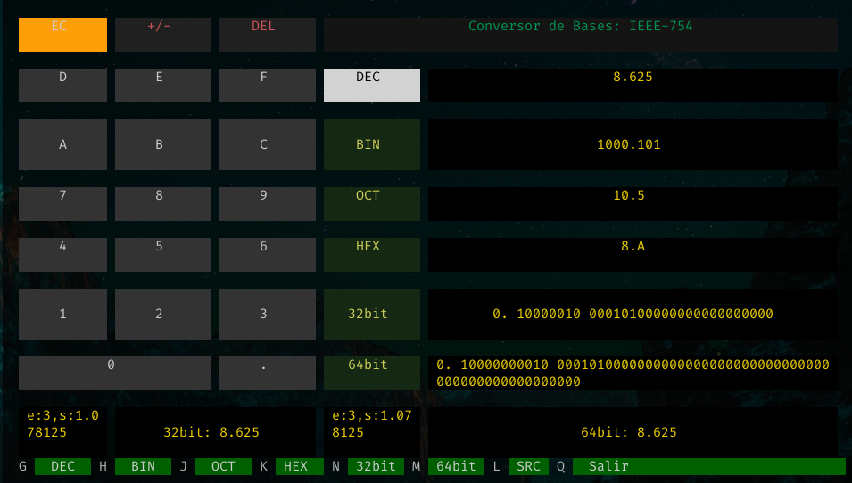

# convbaspy
### A python - textual TUI IEEE-754 Converter app



---
To start:

```bash
    #cd basconv
    python convbaspy.py

```


> **Note**: best to use a python env as textual version is deprecated.

> > Must patch it, but don't know if worth it.

```bash
python -m venv env

source env/bin/activate

```


Install the requirements:
    pip install -r requirements.txt


#### Made with @Textualize/textual
##### https://github.com/Textualize/textual


> Still trying to make it a lightweight executable...
> pyinstaller seems not to like that.


